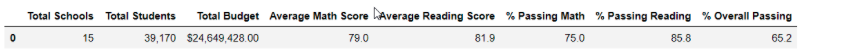

# School_District_Analysis

## Purpose
The purpose of this project is to perform an analysis on school district performance using Jupyter Notebook with Python, Pandas Library and Numpy Library.

## Project Overview
We are assisting Maria to provide an initial analysis based on data collected from stucents and schools throughout the district. The School Board is aiming to understand various performance metrics of the differents schools. Out goal is to provide an analysis with the anomolies examined and removed in order to provide the most accurate results. For this challenge, we have been asked to remove the impact of the inacuracies in the initial results by alteeing all the 9th grade reading and math schools to the null value, Nan. We will outline the impact of changing the 9th grade math and reading scores at Thomas High School to nan.

## Results:

## How is the district summary affected?
The district summary is minimally affected by the changes of replacing the THS 9th grade data with the Nan because the District Summary Data Frame is analyzing data by overall information from the schools and not just the data per student. Average Scores, Passing Scores, and Overall Passing Scores only differ slightly in total. This is due to us excluding the data that was falsified in order to retain an accurate average of passing scores as seen below:

### Original District

### Refactored District

## How is the school summary affected?
The school summary dataframe is affected after removing the altered data from the calculations. The scores for Thomas High School decrease as opposed to when the falsified data was included the percentages of the overall and individual scores for math and reading were much higher. The data shown below differs due to having replaced the 9th grade reading and math scores at Thomas High School with NaN before providing the final analysis.

### Original Per School Summary

### Refactored Per School Summary

## How does replacing the ninth graders’ math and reading scores affect Thomas High School’s performance relative to the other schools?
Thomas High School's overall rank dropped when replacing the 9th graders scores with Nan and excluding the innacurate data. With the original code, the scores overall passing percentage was 90.95% while it drops to roughly 65% after the code is refactored. 

### Original THS Data

### THS % Passing Refactored

## How does replacing the ninth-grade scores affect the following:
### Math and reading scores by grade
The 9th grade students at Thomas High School are the only scores affected in this DataFrame due to having Nan instead of a grade for both math and reading.

### Math/Reading Original vs. Updated
#### Math Original

#### Math Refactored

#### Reading Original

#### Reading Refactored

### Scores by school spending
The slight change in scores by school spending groups scores is for the $630-644 per student grouping due to the fact that this is where Thomas High School was grouped. However, each metric was changed by less than 0.1%.

#### Spending Original

#### Spending Updated

### Scores by school size
The scores for the Medium(1000-2000) size schools changed less that 1 percentage point as displayed in the images below:

#### Scores by School Size Original

#### Scores by School Size Updated

### Scores by school type
Charter School, Thomas High School, is why we see changes to the scores for Charter types. District type school scores were not affected due to not having Thomas High School in the group to skew the results. The results are shown below:

#### Original School Score by Type

#### Updated School Score by Type

## Summary: 
### Four changes in the updated school district analysis after reading and math scores for the ninth grade at Thomas High School have been replaced with NaNs.
- The grade percentages increased for Thomas High School bringing it from a low to a high performing school
- There was no impact to school or student count, only changes to all scores by less the 0.5% points
- The overall percentage of passing increased from a 65 to a 90%
- Changes to Medium (1000-2000) grouping for all scores by less than 0.1 percentage points in Scores by School Size

