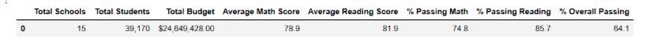
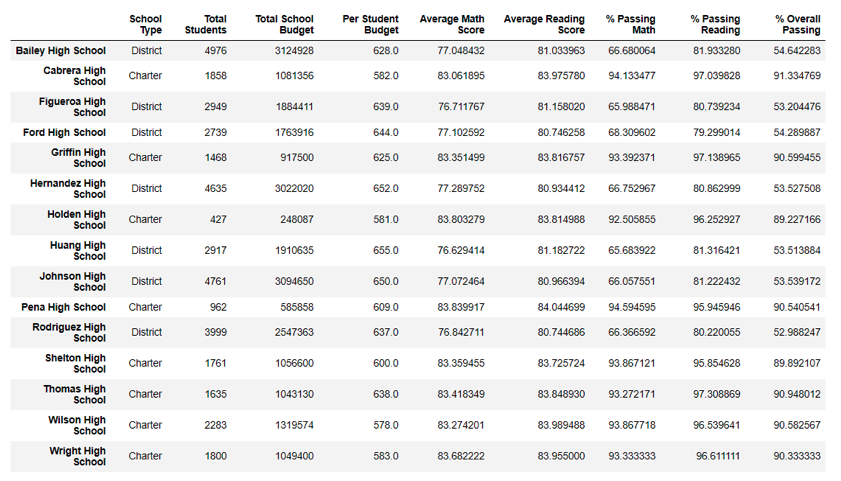
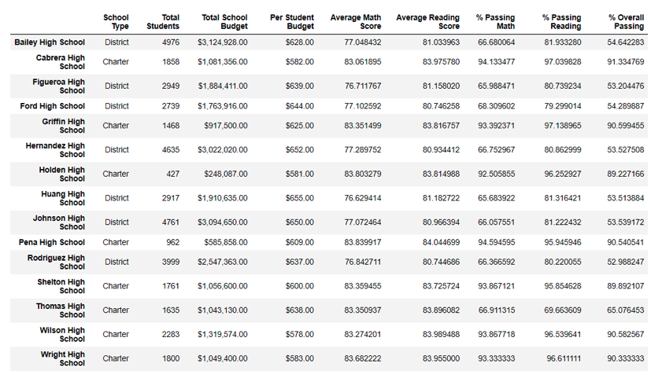

# School_District_Analysis

## Overview
The purpose of this project is to perform an analysis on school district performance using Jupyter Notebook with Python, Pandas Library and Numpy Library.

We are assisting Maria to provide an initial analysis based on data collected from stucents and schools throughout the district. The School Board is aiming to understand various performance metrics of the differents schools. Out goal is to provide an analysis with the anomolies examined and removed in order to provide the most accurate results. For this challenge, we have been asked to remove the impact of the inacuracies in the initial results by alteeing all the 9th grade reading and math schools to the null value, Nan. We will outline the impact of changing the 9th grade math and reading scores at Thomas High School to nan.

## Results: Using bulleted lists and images of DataFrames as support, address the following questions.

## How is the district summary affected?
The district summary is minimally affected by the changes of replacing the THS 9th grade data with the Nan because the District Summary Data Frame is analyzing data by overall information from the schools and not just the data per student. Average Scores, Passing Scores, and Overall Passing Scores only differ slightly in total. This is due to us excluding the data that was falsified in order to retain an accurate average of passing scores as seen below:

### Original District

### Refactored District

## How is the school summary affected?
The school summary dataframe is affected after removing the altered data from the calculations. The scores for Thomas High School decrease as opposed to when the falsified data was included the percentages of the overall and individual scores for math and reading were much higher. The data shown below differs due to having replaced the 9th grade reading and math scores at Thomas High School with NaN before providing the final analysis.

### Original Per School Summary

### Refactored Per School Summary

## How does replacing the ninth graders’ math and reading scores affect Thomas High School’s performance relative to the other schools?

### Original THS Data

### THS % Passing Refactored

## How does replacing the ninth-grade scores affect the following:

### Math and reading scores by grade

### Scores by school spending

### Scores by school size

### Scores by school type

## Summary: Summarize four changes in the updated school district analysis after reading and math scores for the ninth grade at Thomas High School have been replaced with NaNs.

